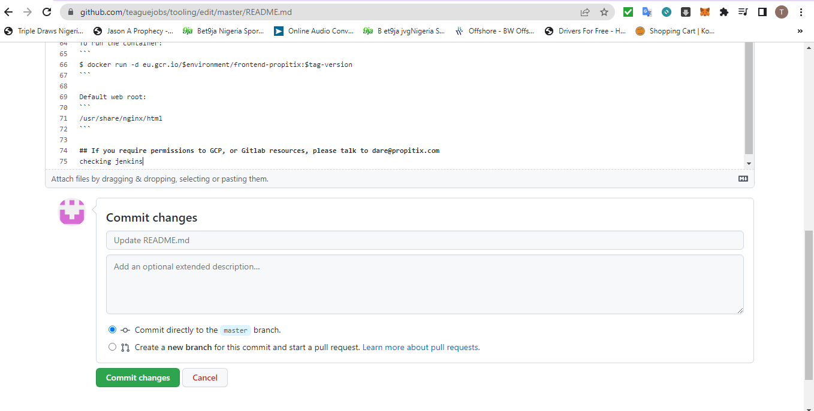

**TOOLING WEBSITE DEPLOYMENT AUTOMATION WITH CONTINUOUS INTEGRATION. INTRODUCTION TO JENKINS**

* INSTALL AND CONFIGURE JENKINS SERVER*

1. Create an AWS EC2 server based on Ubuntu Server 20.04 LTS and name it "Jenkins"

2. Install JDK (since Jenkins is a Java-based application)
`sudo apt update`
`sudo apt install default-jdk-headless`

3. Install Jenkins
`wget -q -O - https://pkg.jenkins.io/debian-stable/jenkins.io.key | sudo apt-key add -
sudo sh -c 'echo deb https://pkg.jenkins.io/debian-stable binary/ > \
    /etc/apt/sources.list.d/jenkins.list'
sudo apt update
sudo apt-get install jenkins`

* Make sure Jenkins is up and running
`sudo systemctl status jenkins`

4. By default Jenkins server uses TCP port 8080 – open it by creating a new Inbound Rule in your EC2 Security Group

5. Perform initial Jenkins setup.

* From your browser access
`http://<Jenkins-Server-Public-IP-Address-or-Public-DNS-Name>:8080`

**Step 2 – Configure Jenkins to retrieve source codes from GitHub using Webhooks**

1. Enable webhooks in your GitHub repository settings

2. Go to Jenkins web console, click "New Item" and create a "Freestyle project"

* To connect your GitHub repository, you will need to provide its URL, you can copy from the repository itself

* if you get error 403 ,goto manage jenkins,security,configure global security,check enable proxy compatibilty ,then save

* In configuration of your Jenkins freestyle project choose Git repository, provide there the link to your Tooling GitHub repository and credentials (user/password) so Jenkins could access files in the repository.

* Save the configuration and let us try to run the build. For now we can only do it manually.
Click "Build Now" button, if you have configured everything correctly, the build will be successfull and you will see it under #1

* But this build does not produce anything and it runs only when we trigger it manually. Let us fix it.

3. Click "Configure" your job/project and add these two configurations
Configure triggering the job from GitHub webhook:

* Configure "Post-build Actions" to archive all the files – files resulted from a build are called "artifacts".

* Now, go ahead and make some change in any file in your GitHub repository (e.g. README.MD file) and push the changes to the master branch.

* You will see that a new build has been launched automatically (by webhook) and you can see its results – artifacts, saved on Jenkins server.

* You have now configured an automated Jenkins job that receives files from GitHub by webhook trigger (this method is considered as ‘push’ because the changes are being ‘pushed’ and files transfer is initiated by GitHub).

* By default, the artifacts are stored on Jenkins server locally
`ls /var/lib/jenkins/jobs/tooling_github/builds/<build_number>/archive/`

**Step 3 – Configure Jenkins to copy files to NFS server via SSH**

1. Install "Publish Over SSH" plugin

* On main dashboard select "Manage Jenkins" and choose "Manage Plugins" menu item.
* On "Available" tab search for "Publish Over SSH" plugin and install it

2. Configure the job/project to copy artifacts over to NFS server.

- On main dashboard select "Manage Jenkins" and choose "Configure System" menu item.
- Scroll down to Publish over SSH plugin configuration section and configure it to be able to connect to your NFS server:

- If someone came across any type of error. Related to invalid private key.Its important to know that Jenkins "Publish Over SSH plugin" accept private key in OpenSSH format

Please use below steps, to convert private key in OpenSSH format. Using Putty gen.

1. Open PuttyGen
2. Click Load
3. Load your private key (Enter passphrase if required)
4. Go to Conversions->Export OpenSSH and export your private key
5. Copy and paste the private key into the Key section of Jenkins SSH Server. Enter Passphrase.
6. Click on "Test Configuration" button, "Success" :)

- Save the configuration, open your Jenkins job/project configuration page and add another one "Post-build Action"
- 
- Configure it to send all files probuced by the build into our previously define remote directory. In our case we want to copy all files and directories – so we use **.

-  change something in README.MD file in your GitHub Tooling repository.
Webhook will trigger a new job and in the "Console Output" of the job you will find something like this:

 

- NOTE: The build might not work until we change permissions on our NFS Server. use this command 
- `sudo chown -R nobody:nobody /mnt`
- `sudo chmod -R 777 /mnt`

- To make sure that the files in /mnt/apps have been updated – connect via SSH/Putty to your NFS server and check README.MD file

- `cat /mnt/apps/README.md`

- If you see the changes you had previously made in your GitHub – the job works as expected.

**Congratulations!
You have just implemented your first Continous Integration solution using Jenkins CI.**

